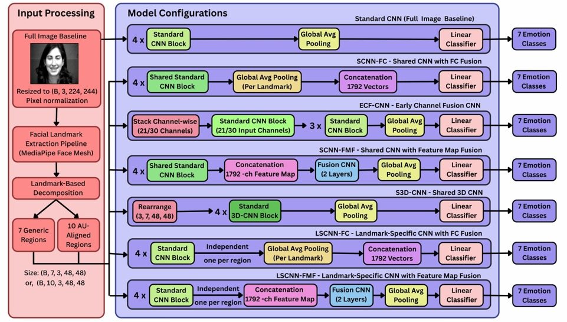

<p align="center">
  <h1 align="center">Facial Emotion Recognition Using Deep Learning</h1>
  <p align="center"><b>Landmark-Based and Action Unit-Aligned Facial Region Feature Extraction</b></p>
  <p align="center">A comparative study of CNN-based landmark processing and fusion strategies for facial expression recognition</p>
</p>

<p align="center">
  
  
  
  
  
  
  
</p>

<p align="center">
  Conducted as an <b>IEEE Computational Intelligence Society (CIS), Kolkata Chapter — Summer Internship 2026</b> project.
</p>

---

## 📌 Quick Summary

| | |
|---|---|
| **Task** | Facial Expression Recognition (7-class emotion classification) |
| **Datasets** | RAF-DB (unconstrained, real-world) · CK+ (controlled, laboratory) |
| **Core Approach** | CNN-based feature extraction over generic facial-landmark regions and FACS Action Unit-aligned regions |
| **Architectures Compared** | 7 (1 full-image baseline + 6 landmark-fusion variants) |
| **Framework** | PyTorch, MediaPipe Face Mesh |
| **Best Result** | **SCNN-FC — 72.88% test accuracy, 0.923 ROC-AUC** on RAF-DB (7 generic regions), ~975K parameters |

---

## 🔬 Problem → 💡 Approach → 🧠 Key Idea → 🎯 Output

**🔬 Problem**
Conventional CNN-based facial expression recognition (FER) processes the full face and must *implicitly* learn which regions are discriminative for each emotion. This holistic processing lacks explicit anatomical structure.

**💡 Proposed Approach**
Each face is decomposed into either **7 generic facial-landmark regions** (eyes, eyebrows, nose, mouth, face contour) or **10 Action Unit (AU)-aligned regions** derived from the Facial Action Coding System (FACS). Seven CNN architectures — differing only in *how* regional information is processed and fused — are systematically compared against a full-image baseline.

**🧠 Key Idea**
A common **Standard CNN Block** (Conv → BatchNorm → ReLU → MaxPool, ×4, channels 3→64→128→256→256) is held constant across all landmark-based architectures. This isolates the effect of **fusion strategy** — shared vs. landmark-specific backbones, feature-vector vs. feature-map fusion, early channel fusion, and 3D convolution — as the true independent variable, rather than backbone capacity.

**🎯 Output**
A 7-class emotion prediction (Surprise, Fear, Disgust, Happiness, Sadness, Anger, Neutral), evaluated on both unconstrained (RAF-DB) and controlled (CK+) imaging conditions.

---

## 📖 Overview

Facial expressions result from coordinated, anatomically localized muscle movements. This project investigates whether making that anatomical structure **explicit** — via landmark decomposition and AU alignment — improves recognition over holistic full-image CNNs, and how much of any improvement depends on the **fusion strategy** used to combine regional features.

Seven architectures are evaluated — a full-image baseline and six landmark-based variants — on two datasets representing different imaging conditions: **RAF-DB** (unconstrained, real-world) and **CK+** (controlled, laboratory).

## 🧩 Problem Statement

Holistic CNNs lack explicit anatomical structure and must implicitly discover discriminative facial regions. Landmark decomposition introduces such structure, but its effectiveness depends on which regions are selected (generic vs. AU-aligned) and how regional features are extracted, shared, and fused. This work investigates both questions jointly.

## 🎯 Research Objective

To determine whether landmark-based and AU-aligned facial-region representations outperform holistic full-image processing, and how CNN-based landmark processing, weight sharing, and fusion strategy affect FER performance across unconstrained (RAF-DB) and controlled (CK+) conditions.

---

## 🏗️ Model Architecture

<p align="center">
  
</p>

<p align="center"><i>Architectural diagram of all tested Region-feature fusion strategies along with the full-image baselines. Here 
Standard CNN block refers to conventional Conv2d+BN+Relu+Maxpool blocks (Conv3d for 3D-CNN variant). "Shared" 
means all regions hare same CNN backbone whereas, "Individual" means every region gets its own CNN backbone.</i></p>

### Input Processing

- **Full-image baseline**: face resized to `(B, 3, 224, 224)`, pixel-normalized.
- **Landmark-based input**: face passed through the MediaPipe Face Mesh landmark-extraction pipeline, decomposed into either 7 generic regions or 10 AU-aligned regions, each cropped and resized to 48×48 — giving a tensor of shape `(B, 7, 3, 48, 48)` or `(B, 10, 3, 48, 48)`.

### Architecture Variants

| Model | Backbone | Fusion Point | Conv Type | Landmark Interaction |
|---|---|---|---|---|
| **StandardCNN** | N/A (full image) | — | Conv2D | None (implicit, full image) |
| **SCNN-FC** ⭐ | Shared | After global-avg-pool (feature vectors) | Conv2D | FC layer only |
| **ECF-CNN** | Shared (21/30-channel input) | Before first conv (channel-stacked) | Conv2D | First layer |
| **SCNN-FMF** | Shared | Feature maps (pre-pooling) | Conv2D | 2-layer fusion CNN |
| **S3D-CNN** | Shared | Throughout (3D convolution) | Conv3D | Entire network |
| **LSCNN-FC** | Landmark-specific | After global-avg-pool (feature vectors) | Conv2D | FC layer only |
| **LSCNN-FMF** | Landmark-specific | Feature maps (pre-pooling) | Conv2D | 2-layer fusion CNN |

<sub>⭐ = best-performing configuration in this study</sub>

- **Shared** backbone = one CNN applied to every region (weight sharing across regions).
- **Landmark-specific** backbone = an independent CNN per region (no weight sharing).
- **Feature-vector fusion** = each region is globally average-pooled to a 256-d vector *before* fusion; per-region vectors are concatenated (7×256 = 1792-d, or 10×256 = 2560-d) and passed to a linear classifier.
- **Feature-map fusion** = per-region 256-channel feature maps are concatenated *before* pooling, then passed through a 2-layer fusion CNN (1792→512→256, or 10-region equivalent) before global average pooling and classification.
- **ECF-CNN** stacks all region crops along the channel dimension (e.g. 7×3 = 21 channels) and processes them with a single CNN whose first convolution accepts the corresponding number of input channels.
- **S3D-CNN** rearranges the landmark axis into a depth dimension `(B, 3, N, 48, 48)` and uses a Conv3D backbone so that region, height, and width are modeled jointly.

All variants terminate in global average pooling → dropout → a linear layer producing **7 emotion-class logits**.

---

## 🗂️ Dataset

| Dataset | Conditions | Classes | Samples used | Split |
|---|---|---|---|---|
| **RAF-DB** | Unconstrained, real-world (internet images; varied illumination, pose, background) | 7 (Surprise, Fear, Disgust, Happiness, Sadness, Anger, Neutral) | 15,339 images | 10,737 train / 2,301 val / 2,301 test (stratified 70/15/15) |
| **CK+** | Controlled, laboratory (Extended Cohn-Kanade) | 7 (Anger, Disgust, Fear, Happiness, Sadness, Surprise, Neutral) | ~3,000 images (from 327 labeled sequences, 123 subjects) | Train/val/test, consistent evaluation methodology |

**Preprocessing**
- Full-image branch: resize to 224×224, RGB, normalized (ImageNet mean/std).
- Landmark branch: MediaPipe Face Mesh landmark detection → region crops (7 generic or 10 AU-aligned) → resize to 48×48 → normalized.
- Data augmentation (random horizontal flip, rotation, color jitter) is available via `--augment`, but the reported experiments were run **without** augmentation to isolate architectural effects.

<details>
<summary><b>7 Generic Landmark Regions</b> (click to expand)</summary>
<br>

`left_eye`, `right_eye`, `left_eyebrow`, `right_eyebrow`, `nose`, `mouth`, `face_oval` — each defined by a fixed set of MediaPipe Face Mesh landmark indices (`src/Preprocessing/au_mapping.py`).

</details>

<details>
<summary><b>10 AU-Aligned Regions (FACS)</b> (click to expand)</summary>
<br>

**AU1** (Inner Brow Raiser) · **AU2** (Outer Brow Raiser) · **AU4** (Brow Lowerer) · **AU5** (Upper Lid Raiser) · **AU6** (Cheek Raiser) · **AU9** (Nose Wrinkler) · **AU12** (Lip Corner Puller) · **AU15** (Lip Corner Depressor) · **AU17** (Chin Raiser) · **AU26** (Jaw Drop)

Each AU is mapped to a combination of MediaPipe landmark regions at runtime (`build_au_region_plan` / `build_action_units` in `src/Preprocessing/au_mapping.py`).

</details>

---

## 🔄 Methodology / Pipeline

```text
Dataset (RAF-DB / CK+)
   ↓
Image Load + Resize
   ↓
Facial Landmark Detection (MediaPipe Face Mesh)
   ↓
Region Decomposition (7 generic OR 10 AU-aligned regions)
   ↓
Per-Region Crop (48×48) + Normalization
   ↓
CNN Feature Extraction (shared or landmark-specific backbone)
   ↓
Feature Fusion (vector concat / feature-map concat / early channel / 3D conv)
   ↓
Global Average Pooling → Dropout → Linear Classifier
   ↓
Emotion Prediction (7 classes)
   ↓
Evaluation (Accuracy, Precision, Recall, F1, ROC-AUC, Confusion Matrix)
```

---

## 🧪 Experiments

- **Baseline**: StandardCNN on the full 224×224 image.
- **Landmark-based configurations**: each of the six landmark architectures (SCNN-FC, ECF-CNN, SCNN-FMF, S3D-CNN, LSCNN-FC, LSCNN-FMF) trained on both the 7-generic-region input and the 10-AU-aligned-region input.
- **Datasets**: all configurations trained and evaluated separately on RAF-DB and CK+.
- **Training setup**: Adam optimizer, Cross-Entropy loss, learning rate 0.01, `ReduceLROnPlateau` scheduler, batch size 64, up to 200 epochs, early stopping (patience 10, monitored on validation loss). Actual training ranged from 11–62 epochs depending on configuration.
- Result tables were also provisioned for **FER-2013**; those experiments have not yet been run and are left for future work.

---

## 📊 Results

> All results below are from the internship report (RAF-DB / CK+, seven emotion classes). **SCNN-FC** (Shared CNN with feature-vector fusion) is the primary/best-performing model in this study.

### RAF-DB — Generic (7LM) vs. AU-Aligned (10AU) Regions

| Model | Best Val Acc. | Test Acc. | Precision | Recall | F1-Score | ROC-AUC |
|---|---|---|---|---|---|---|
| StandardCNN (full-image baseline) | 0.71 | 0.70 | 0.65 | 0.56 | 0.59 | 0.91 |
| | **7LM / AU** | **7LM / AU** | **7LM / AU** | **7LM / AU** | **7LM / AU** | **7LM / AU** |
| **SCNN-FC** ⭐ | 0.74 / 0.73 | **0.73 / 0.71** | 0.72 / 0.71 | 0.59 / 0.57 | 0.63 / 0.62 | 0.92 / 0.91 |
| ECF-CNN | 0.71 / 0.70 | 0.68 / 0.68 | 0.68 / 0.68 | 0.53 / 0.52 | 0.58 / 0.57 | 0.90 / 0.89 |
| SCNN-FMF | 0.73 / 0.71 | 0.68 / 0.68 | 0.70 / 0.65 | 0.49 / 0.54 | 0.52 / 0.57 | 0.90 / 0.89 |
| S3D-CNN | 0.71 / 0.39 | 0.66 / 0.39 | 0.64 / 0.06 | 0.48 / 0.14 | 0.51 / 0.08 | 0.89 / 0.57 |
| LSCNN-FC | 0.72 / 0.63 | 0.71 / 0.61 | 0.68 / 0.54 | 0.56 / 0.43 | 0.60 / 0.45 | 0.90 / 0.83 |
| LSCNN-FMF | 0.73 / 0.60 | 0.71 / 0.59 | 0.66 / 0.51 | 0.55 / 0.38 | 0.59 / 0.39 | 0.91 / 0.81 |

### CK+ — Generic (7LM) vs. AU-Aligned (10AU) Regions

| Model | Best Val Acc. | Test Acc. | Precision | Recall | F1-Score | ROC-AUC |
|---|---|---|---|---|---|---|
| StandardCNN (full-image baseline) | 0.33 | 0.30 | 0.27 | 0.34 | 0.26 | 0.73 |
| | **7LM / AU** | **7LM / AU** | **7LM / AU** | **7LM / AU** | **7LM / AU** | **7LM / AU** |
| **SCNN-FC** ⭐ | 0.58 / 0.58 | 0.54 / 0.57 | 0.49 / 0.53 | 0.50 / 0.52 | 0.48 / 0.52 | 0.87 / 0.86 |
| ECF-CNN | 0.56 / 0.55 | 0.54 / 0.53 | 0.48 / 0.47 | 0.51 / 0.49 | 0.49 / 0.47 | 0.86 / 0.86 |
| SCNN-FMF | 0.60 / 0.59 | 0.53 / 0.55 | 0.49 / 0.50 | 0.52 / 0.52 | 0.47 / 0.49 | 0.86 / 0.86 |
| S3D-CNN | 0.58 / 0.28 | 0.54 / 0.15 | 0.48 / 0.02 | 0.52 / 0.12 | 0.49 / 0.03 | 0.86 / 0.50 |
| LSCNN-FC | 0.56 / 0.28 | 0.54 / 0.13 | 0.47 / 0.07 | 0.50 / 0.14 | 0.47 / 0.06 | 0.86 / 0.58 |
| LSCNN-FMF | 0.59 / 0.28 | 0.52 / 0.28 | 0.48 / 0.03 | 0.49 / 0.12 | 0.46 / 0.05 | 0.86 / 0.50 |

<sub>7LM = 7 generic landmark regions · 10AU = 10 Action Unit-aligned regions · StandardCNN does not apply to the landmark-based 10AU configuration.</sub>

<details>
<summary><b>📈 Model Complexity & Training Cost</b> (Parameters (M) / Avg. epoch time (s)) — click to expand</summary>
<br>

| Model | RAF-DB 7LM | RAF-DB 10AU | CK+ 7LM | CK+ 10AU |
|---|---|---|---|---|
| StandardCNN | 0.39M / 60.75s | — | 0.39M / 262.35s | — |
| **SCNN-FC** | 0.97M / 252.12s | 0.98M / 271.84s | 0.98M / 578.71s | 0.98M / 597.54s |
| ECF-CNN | 0.97M / 235.95s | 0.98M / 252.26s | 0.97M / 558.32s | 0.98M / 583.60s |
| SCNN-FMF | 10.40M / 288.25s | 13.94M / 272.56s | 10.40M / 633.73s | 13.94M / 643.99s |
| S3D-CNN | 2.88M / 314.86s | 2.88M / 317.75s | 2.88M / 640.99s | 2.88M / 743.04s |
| LSCNN-FC | 6.75M / 283.46s | 9.64M / 272.86s | 6.75M / 574.92s | 9.64M / 634.80s |
| LSCNN-FMF | 16.18M / 261.76s | 22.60M / 279.38s | 16.18M / 650.06s | 22.60M / 649.34s |

</details>

> **Key finding:** SCNN-FC (shared backbone, late feature-vector fusion) achieved the best overall trade-off — **72.88% test accuracy, 0.923 ROC-AUC** on RAF-DB (7LM) with only ~975K parameters — outperforming both the full-image baseline and higher-parameter landmark-specific / feature-map-fusion variants. Landmark decomposition alone did not consistently beat the baseline (ECF-CNN, SCNN-FMF, S3D-CNN did not show a consistent advantage), and AU-aligned regions did not show a consistent benefit over generic regions under the reported (non-identical) training conditions. This project is experimental, and results for FER-2013 and CK+ under identical hyperparameters to RAF-DB are part of ongoing/future work.

---

## 📁 Repository Structure

```text
Facial_Emotional_Recognition/
├── docs/
│   └── architecture.png          # Model architecture diagram (referenced in this README)
├── src/
│   ├── Main/
│   │   └── main.py               # Experiment entry point (argument parsing, dataset, training, evaluation, logging)
│   ├── Preprocessing/
│   │   ├── landmarks.py          # MediaPipe Face Mesh detection + region/patch extraction
│   │   ├── au_mapping.py         # 7 generic region definitions, AU→landmark mappings, AU region-plan builder
│   │   └── cropping.py           # Patch cropping and normalization/transform utilities
│   ├── Models/
│   │   ├── standard_cnn.py       # StandardCNN (full-image baseline)
│   │   ├── scnn_fc.py            # SCNN-FC (shared backbone, feature-vector fusion)
│   │   ├── ecf_cnn.py            # ECF-CNN (early channel fusion)
│   │   ├── scnn_fmf.py           # SCNN-FMF (shared backbone, feature-map fusion)
│   │   ├── s3d_cnn.py            # S3D-CNN (shared 3D convolution over landmark axis)
│   │   ├── lscnn_fc.py           # LSCNN-FC (landmark-specific backbones, feature-vector fusion)
│   │   ├── lscnn_fmf.py          # LSCNN-FMF (landmark-specific backbones, feature-map fusion)
│   │   └── legacy_models.py      # SimpleCNN / LandmarkCNN / LandmarkResNet18 (earlier baseline models)
│   ├── Training/
│   │   ├── train.py              # Training loop with early stopping
│   │   └── eval.py               # Loss/accuracy evaluation + classification metrics, confusion matrix, ROC curves
│   ├── Utils/
│   │   ├── metrics.py            # Precision-recall curve plotting
│   │   └── visualization.py      # Training-curve and sample-prediction plotting
│   └── Results/
│       ├── NO AU/                # Per-model checkpoints, logs (JSON/CSV), and result plots — 7 generic regions
│       └── WITH AU/              # Per-model checkpoints, logs (JSON/CSV), and result plots — 10 AU-aligned regions
├── requirements.txt
└── README.md
```

Each model's `Results/<CONFIG>/<MODEL>/` folder contains a `MODEL/` checkpoint, `Result_images/` (accuracy/loss curves, confusion matrix, ROC curve, precision-recall curve, sample predictions), and `Result_logs/` (a full JSON experiment log and a summary CSV row).

---

## ⚙️ Installation

### Prerequisites
- Python 3.9+ (project uses standard `torch`/`torchvision`/`mediapipe` APIs)
- Git
- A CUDA-capable GPU is recommended for training but not required (the code auto-selects CPU/GPU)

### 1. Clone the repository

```bash
git clone https://github.com/Rupam-web190/facial-emotion-recognition-au-landmarks.git
cd Facial_Emotional_Recognition
```

### 2. Create a virtual environment

**Linux / macOS**
```bash
python3 -m venv venv
source venv/bin/activate
```

**Windows**
```bash
python -m venv venv
venv\Scripts\activate
```

### 3. Install dependencies

```bash
pip install -r requirements.txt
```

### 4. Download the MediaPipe Face Landmarker model

The landmark-extraction pipeline (`src/Preprocessing/landmarks.py`) loads a MediaPipe Face Landmarker model from a local file path (`face_landmarker.task` by default). This file is **not bundled** in the repository and must be downloaded separately from MediaPipe's model repository and placed at the path referenced in `landmarks.py` (or that path updated accordingly). If this file is missing, landmark extraction fails and the pipeline returns zero-valued patches.

---

## 🗃️ Dataset Setup

> **Both Kaggle and local execution are supported by the codebase's directory conventions**, but `src/Main/main.py` currently hardcodes a Kaggle input path. To run outside Kaggle, this must be edited directly — see below (there is no environment variable or config file for this yet; see *Recommended Improvements*).

Expected directory layout (matching the RAF-DB layout used on Kaggle):

```text
<dataset_root>/
└── dataset/
    ├── train_labels.csv
    ├── test_labels.csv
    ├── aligned/
    │   ├── train/
    │   │   └── train_images/
    │   └── test/
    │       └── test_images/
```

**On Kaggle** — no changes needed, `main.py` already points to:
```python
"dataset_path": "/kaggle/input/datasets/tanishmittal/rafdb"
```

**For local execution** — edit these lines in `src/Main/main.py`:
```python
experiment_log["dataset_info"] = {
    ...
    "dataset_path": "/kaggle/input/datasets/tanishmittal/rafdb"   # <-- change to your local dataset root
}
...
train_csv = pd.read_csv("/kaggle/input/datasets/tanishmittal/rafdb/dataset/train_labels.csv")  # <-- update path
test_csv = pd.read_csv("/kaggle/input/datasets/tanishmittal/rafdb/dataset/test_labels.csv")    # <-- update path
```

`IMG_DIR` is derived automatically from `dataset_path` as `<dataset_path>/dataset/aligned`, so updating `dataset_path` is sufficient once the CSV paths above are also corrected.

The dataset labels CSVs must contain an `image` column (filenames prefixed `train_`/`test_`) and a `label` column (1-indexed emotion class).

## 🔧 Configuration

Key run-time behavior is controlled entirely through CLI arguments to `main.py` (see **Usage** below) — there is no separate YAML/JSON configuration file in this repository.

---

## ▶️ Usage / How to Run

Run from the repository root (module resolution is handled automatically by `main.py`):

```bash
python src/Main/main.py --model StandardCNN --epochs 25
```

<details>
<summary><b>📋 Key Arguments</b> (click to expand)</summary>
<br>

| Argument | Description |
|---|---|
| `--model, -m` | Model to train: `cnn`, `ResNet18`, `StandardCNN`, `SCNN_FC`, `ECF_CNN`, `SCNN_FMF`, `S3D_CNN`, `LSCNN_FC`, `LSCNN_FMF` |
| `--epochs, -e` | Number of training epochs (default 25) |
| `--lr, -lr` | Learning rate (overrides the model-specific default if provided) |
| `--batch_size, -bs` | Batch size (default 64) |
| `--use_landmarks` | Enable landmark-based input (required for all landmark models) |
| `--num_landmarks, -nl` | Number of generic landmark regions to use (default 7) |
| `--use_au, --with_au` | Use AU-aligned regions instead of generic regions, e.g. `--use_au AU1 AU2 AU4 AU5 AU6 AU9 AU12 AU15 AU17 AU26` |
| `--optimizer, -opt` | `Adam` or `SGD` |
| `--scheduler, -sch` | `None`, `ReduceLROnPlateau`, or `CosineAnnealingLR` |
| `--augment, -aug` | Enable data augmentation (random flip/rotation/color jitter) |
| `--dropout, -do` | Dropout rate (default 0.4) |
| `--weight_decay, -wd` | Weight decay (default 1e-5) |
| `--early_stopping_patience, -esp` | Early stopping patience in epochs (default 10) |
| `--output_dir, -o` | Directory to save checkpoints, logs, and plots |
| `--device, -dev` | `auto`, `cuda`, or `cpu` |
| `--seed, -s` | Random seed (default 42) |
| `--no_plot` | Disable result plot generation |
| `--pretrained` / `--freeze_backbone` | Applicable to `ResNet18` transfer-learning variant only |

</details>

**Full-image baseline:**
```bash
python src/Main/main.py --model StandardCNN --epochs 200 --lr 0.01 --optimizer Adam --scheduler ReduceLROnPlateau
```

**7-generic-landmark configuration (best result, SCNN-FC):**
```bash
python src/Main/main.py --model SCNN_FC --use_landmarks --num_landmarks 7 --epochs 200 --lr 0.01 --optimizer Adam --scheduler ReduceLROnPlateau
```

**10 AU-aligned regions:**
```bash
python src/Main/main.py --model SCNN_FC --use_landmarks --use_au AU1 AU2 AU4 AU5 AU6 AU9 AU12 AU15 AU17 AU26 --epochs 200 --lr 0.01 --optimizer Adam --scheduler ReduceLROnPlateau
```

---

## 📤 Expected Outputs

For each run, `main.py` saves the following to `--output_dir`:

| Output | Description |
|---|---|
| `Checkpoint_..._.pt` | Best model weights (by validation loss) |
| `ExperimentLog_..._.json` | Full experiment log (system info, framework versions, dataset info, per-epoch metrics, timing) |
| `Results_..._.csv` | Single-row summary of hyperparameters and final test metrics |
| `AccuracyCurve_...png`, `LossCurve_...png` | Training/validation curves |
| `ConfusionMatrix_...png` | Test-set confusion matrix |
| `ROCCurve_...png` | Per-class ROC curves (one-vs-rest) |
| `PrecisionRecall_...png` | Precision-recall curve |
| `SamplePredictions_...png` | Qualitative prediction samples |

---

## 🔁 Reproducibility

- **Random seed**: `42` (fixed via `--seed`, applied to `torch.manual_seed` and CUDA seeding; deterministic cuDNN mode enabled when CUDA is available).
- **Dataset split**: stratified 70/15/15 train/val/test (RAF-DB), via `sklearn.model_selection.train_test_split` with the fixed seed.
- **Training configuration** (reported results): Adam, learning rate 0.01, `ReduceLROnPlateau`, batch size 64, up to 200 epochs, early stopping patience 10, no data augmentation.
- Hardware specifications, exact weight-decay/dropout values used per model, and initialization details beyond He/Kaiming initialization were not explicitly documented in the source report and are therefore not assumed here.

---

## ⚠️ Limitations

- Facial landmark decomposition alone does not consistently outperform the full-image baseline; effectiveness depends heavily on the fusion strategy.
- AU-aligned regions showed no consistent benefit over generic regions in the reported experiments, but the 7LM and 10AU configurations were **not trained under identical optimization conditions** (particularly learning rate), so this comparison is not fully controlled.
- No data augmentation was used in the reported experiments, which may understate the achievable performance of all models.
- S3D-CNN and the landmark-specific models (LSCNN-FC, LSCNN-FMF) showed pronounced sensitivity to learning rate in the 10AU configuration.
- Results for FER-2013 and CK+ under the same controlled settings as RAF-DB are incomplete.

## 🔮 Future Work

- Evaluate all architectures on FER-2013 and complete CK+ experiments under identical training conditions to RAF-DB.
- Re-run the 7LM vs. 10AU comparison with a matched learning rate (0.01) across all models to isolate the effect of AU alignment from optimization differences.
- Explore attention- and transformer-based fusion mechanisms for cross-region interaction.

## 🛠️ Recommended Improvements

*(Not currently implemented — suggestions for future contributors.)*

- Replace the hardcoded Kaggle dataset path in `src/Main/main.py` with a `--data_root` CLI argument or an environment variable, so the same script runs unmodified both on Kaggle and locally.
- Add a bundled or scripted download step for the MediaPipe `face_landmarker.task` model file.

---

## 🧰 Technologies Used

<p>
  
  
  
  
  
  
  
  
  
  
</p>

---

## 📄 Citation / Research Reference

If you use this work, please cite the underlying internship report:

```bibtex
@techreport{majumdar2026fer,
  title        = {Facial Expression Recognition Using Generic and Action Unit-Aligned Facial Regions: A Comparative Study of CNN-Based Landmark Processing and Fusion Strategies},
  author       = {Majumdar, Rupam},
  institution  = {IEEE Computational Intelligence Society (CIS), Kolkata Chapter},
  type         = {Summer Internship Report},
  year         = {2026}
}
```

## 🙏 Authors / Acknowledgements

| Role | Name | Affiliation |
|---|---|---|
| Teammate | Kishalay Das | Dept. of CSE, MCKV Institute of Engineering, Howrah, West Bengal, India |
| Mentor | Dr. Asit Barman | Asst. Prof., CSE/IT, Siliguri Institute of Technology, West Bengal, India |
| Program | IEEE CIS, Kolkata Chapter | Summer Internship 2026 (1 June – 31 August 2026) |

With additional technical assistance from **Mr. Sayan Kumar Bhowmick**.

---

<p align="center">
  ⭐ If you find this project useful, consider starring the repository.
</p>
